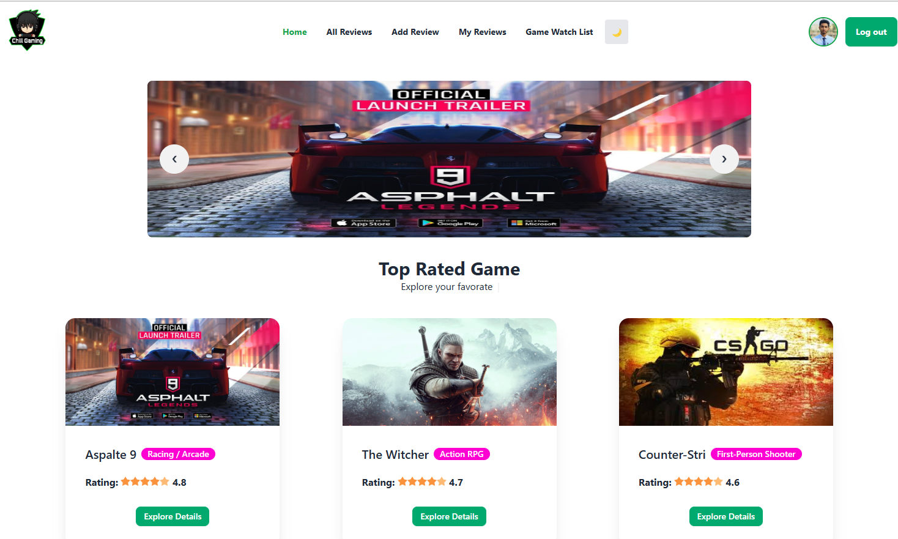

## Project Overview
Chill Gamer is a game review platform where users can explore, write, and share game reviews. The application features a clean, responsive design that ensures a seamless and enjoyable user experience.

# Chill Gamer  

[**Live Site URL:**](https://chill-gamer-493d7.web.app/) 

## How to look



## Technologies Used
- Frontend: React.js, TailwindCSS
- Backend: Node.js, Express.js
- Database: MongoDB
- Authentication: Firebase Authentication, JWT
- Other: RESTful APIs, Filtering & Sorting, Pagination


## Core Features  
- **User-Friendly Interface:** Designed with a simple and responsive layout.  
- **Dark/Light Theme Toggle:** Allows users to switch themes as per their preference.  
- **Game Reviews:** Read detailed reviews of popular games.  
- **Highest Rated Games:** Easily access a list of top-rated games.  
- **Dynamic & Static Sections:** Various sections to present meaningful information effectively. 
- **User Authentication:** Secure login and registration using Firebase Authentication & JWT. 
- Game Reviews: Users can browse, submit, edit, and delete their reviews.

## Dependencies Used
- "@fisch0920/use-dark-mode": "^2.4.0" - For dark mode toggle
- "firebase": "^11.0.2" - Authentication and database integration
- "localforage": "^1.10.0" - Storage management
- "match-sorter": "^8.0.0" - Advanced filtering and sorting
- "react-dom": "^18.3.1" - React rendering engine
- "react-hot-toast": "^2.4.1" - Notifications and alerts
- "react-loader-spinner": "^6.1.6" - Loading spinners
- "react-router-dom": "^7.0.2" - Routing and navigation
- "react-simple-typewriter": "^5.0.1" - Typing animations
- "react-tooltip": "^5.28.0" - Interactive tooltips
- "sweetalert2": "^11.14.5" - Beautiful alert popups

## Installation
To run this project locally:

1. Clone the repository:
   ```bash
   git clone https://github.com/Khandaker-Mohyet/Chill-Gamer-client.git
   ```
2. Navigate to the project directory:
   ```bash
   cd Chill-Gamer-client
   ```
3. Install the dependencies:
   ```bash
   npm install
   ```
4. Start the development server:
   ```bash
   npm start
   ```


Chill Gamer is built to provide you with a chill and engaging game review experience. 